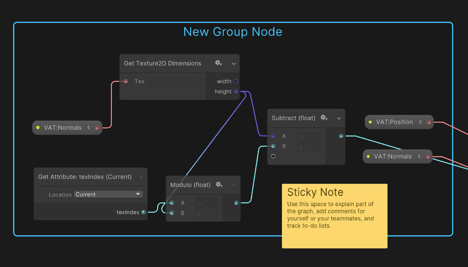

# VFX Graph 基本介绍

[TOC]

<!-- toc -->

## 能做什么

- Create one or multiple particle systems
- Add static meshes and control shader properties
- Create events via C# or Timeline to turn parts of your effects on and off 
- Extend the library of features by creating subgraphs of commonly used node combinations
- Use a VFX Graph inside of another VFX Graph (e.g., smaller explosions as part of another, larger effect)
- Preview changes at various rates and/or perform step-by-step simulation

## [要求和兼容性](https://docs.unity3d.com/Packages/com.unity.visualeffectgraph@17.0/manual/System-Requirements.html)

### 软件

HDRP Unity Editor >= 2019.2

URP Unity Editor >= 2021.2  VFX Graph 12.x版本及以上正式对

### 硬件

supports compute shaders

Support for Shader Storage Buffer Objects (SSBOs)

OpenGL ES 不适合 VFX Graph，您应该在针对移动平台时使用 Vulkan

### 对比Particle System

## **关键概念**

VFX Graph可以分为三层

- 最下面这一层是特效的使用者，在设计好的特效上面进行调参，设置交互，暴露的参数可以用代码修改，不需要复杂的知识，适合所有特效/关卡艺术家/程序。
- 第二层是特效制作家，可以在这个系统上生产特效资源。
- 最上面这一层是开放给更高级的特效艺术家或TA同学，提供了自定义拓展的功能，note和block都可以扩展，可以自己定义一些节点。

## 基本介绍

一个特效物体由两部分组成：

Visual Effect (VFX) component

Visual Effect (VFX) Graph Asset 

### Graph window

右上角两个按钮可以开关**Blackboard**  和**VFX Control panel** 

- **Blackboard:** (控制变量)To manage properties and Global variables that are reusable throughout the graph
- **VFX Control panel:** (控制播放时机、速率)To modify playback on the attached GameObject

### Visual effect bounds

bounds是粒子效果的显示边界，是一个立方体框。框外的粒子会被相机剔除。Editor中，只有Play模式下才会有剔除效果。

三种配置方法

- **Manual**: You set the bounds directly in the Initialize Context. You can calculate the bounds dynamically using Operators and send the output to the Initialize Context's **Bounds** input ports.
- **Recorded**: Allows you to record the System from the Target visual effect GameObject panel. For information on how to do this, see [Bounds Recording](https://docs.unity3d.com/Packages/com.unity.visualeffectgraph@16.0/manual/visual-effect-bounds.html#bounds-recording). In this mode, you can also calculate the bounds using Operators and pass them to the Initialize Context, like in **Manual**. This overrides any recorded bounds.
- **Automatic**: Unity calculates the bounds automatically. Note: This will force the culling flags of the VFX asset to "Always recompute bounds and simulate".

### Systems, Contexts, and Blocks

整个VFX的执行流程Blocks是从上往下垂直进行。Node是从左往右水平执行。

从上往下4个Contexts主要控制粒子生命周期的四个阶段。

**Spawn**->**Initialize**->**Update**->**Output**

- **Spawn:** Determines **how many** particles you should create and **when** to spawn them (e.g., in one burst, looping, with a delay, etc.)
- **Initialize:** Determines the **starting Attributes** for the particles, as well as the Capacity (maximum particle count) and Bounds (volume where the effect renders)
- **Update:** Changes the particle properties **each frame**; here you can **apply Forces**, **add animation**, **create Collisions**, or **set up some interaction**, such as with Signed Distance Fields (SDF) 
- **Output:** (可以有多个)Renders the particles and determines their **final look** (color, texture, orientation); each System can have **multiple outputs** for maximum flexibility

### Properties and Operators

操作运算和Shader Graph一样是从左往右进行。

在 Blackboard中创建的变量，Exposed决定其是否能在Component中显示以及代码能不能读取到。

Exposed的变量会有绿点。

在Inspector中的Properties可以看到Exposed 的变量。复选框表示该值是否被更改过。

### Group Nodes and Sticky Notes

Group Node和Sticky Note注释用。Group Node在Node->Misc中，Sticky Note右键创建。

### Subgraphs

选中多个Node右键创建，便于模块化。

### Attributes

在System中可以创建属性供计算使用，如果没有初始化会有默认值。

### Events

对于Spawn Context可以连接不同的Even来供代码使用。

可以通过继承`UnityEngine.VFX.Utility.VFXOutputEventAbstractHandler` class来制作Handler.

#### GPU Event

可以使用GPU Event去生成其他更多的粒子，或者通知其他系统，以形成一条链。例如，炮弹在空中一段时间爆炸。

开启GPU Event

对于14.0.9版本的VFX Graph，默认是没有开启GPU Event的。需要到**Edit > Preferences > Visual Effects**. 勾选**Experimental Operators/Blocks**。

在 **Update Blocks**中，发生GPU Event Data的方法：

- **Trigger Event On Die:** Spawns particles on another system when a particle dies
- **Trigger Event Rate:** Spawns particles per second (or based on their velocity)
- **Trigger Event Always:** Spawns particles every frame

#### Event Attributes

可以通过事件来更高效地传递属性，

 使用**Get Source Attribute** 操作或**Inherit Attribute Blocks**.

注意：

- 输出的属性，必须要被初始化，不能是默认值。
- 输出的属性不能获取到之后的变化。

## 案例

**Package Manager** 中的The VFX Graph Additions 

[GitHub官方案例](https://github.com/Unity-Technologies/VisualEffectGraph-Samples)

[官方文档](https://docs.unity3d.com/Packages/com.unity.visualeffectgraph@17.0/manual/index.html)

## 其他

random node

------

## Reference

> [Unity社区文章 《利用 VFX 制作特效为作品赋能添翼》](https://developer.unity.cn/projects/641174fdedbc2a34b85ad221)

> [Unity官方E-book 《The definitive guide to creating advanced visual effects in Unity](https://create.unity.com/definitive-guide-to-creating-advanced-visual-effects)》

